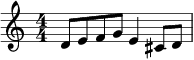
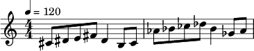

Syntax Guide
============

An illustrative guide of the Hikari notation syntax. The score images are generated with Lilypond.

Character Set
-------------

The string should contain only ASCII characters. Spaces and returns are ignored entirely, even when they separate syntactical tokens.

Notes and Chords
----------------

Notes in *Hikari* are represented by *upper-cased* letters A to G.

.. code-block:: text

    DE,FG,E,CD,

Accidentals of the notes are notated with ``#`` for sharps, ``b`` for flats, ``x`` for double sharps, and ``bb`` for double flats. The accidentals come *after* note letters.

.. code-block:: text

    DE,FG,E,C#D,

The notes are placed in the 4th octave by default (from the middle C *C4* to the note at a major 7th above it *B4*). To change the octave range, use an integer after a note name to modify the default octave range, or less than/greater than signs ``<`` ``>`` to temporarily modify the octave range of a single note.

.. code-block:: text

    CEGC>,E>,
    G5ECG4,C,

A chord consisting of multiple notes is notated by surrounding the notes in a pair of parentheses ``()``, and rests are notated with dots (``.``).

.. code-block:: text

    D5, (B<DG), G<, .,

Prolongations of notes or chords are notated with dashes (``-``).

.. code-block:: text

    (CE),-, (B<D)(CE)(B<D)(CE), (DF)(CE),
    (B<D), (B<G), ., .,

Musical Structure
-----------------

The most basic component of a piece of music is a *beat*. The beats are separated by commas (``,``). The notes (chords, rests) in a single beat divide the beat into parts of equal length. All beats should be terminated by a comma, in other words, extra notes that aren't ended with a comma are not allowed. A beat containing no notes or chords is defaulted to have a rest inserted.

.. code-block:: text

    (C6E), ------ EDCB5AG, F(DF), (CE)(CE),

The beats are grouped into measures automatically. To change the time signature, refer to the later section on Attributes.

A score may also contain multiple *staves*, in which case a *section* can be created by separating scores for the respective staff with semicolons (``;``) and surrounding the whole group with curly braces (``{}``). The staves should be written top-to-bottom.

.. code-block:: text

    {.(C3E),(CE)(CE),(CE)(CE),(CE)(CE),
     (CE)(CE),(CE)(CE),(CE)(CE),(DF#)(DF#),;
     C2(CG),(CG)(CG),(CG)(CG),(CG)(CG),
     (CG)(CG),(CG)(CG),(CG)(CG),(CA)(CA),}

In some polyphonic passages, a single staff might be further divided into multiple *voices*. In this scenario, divide a staff into voices by separating the voices with semicolons (``;``) and surrounding the group with square brackets (``[]``). The voices should be written from top to bottom similarly.

.. code-block:: text

    {[G#5,-,F#,E, D#,-,C#,-,
      D#,-,E,F#, (EG#),-,(D#F#),-,;
      (B4E>),-,(AD#>),(G#C#>), (F#B#),-,E,-,
      (AB),-,B,(C#>E>), B,-,-,A,];

      (EG#),-,(B<D#F#),(C#E), (G#<B#<D#),-,(A<C#),-,
      (F#3ABD#>),-,(G#BE>),(AC#4F#),
      [(EG#),-,(D#F#),-,; B3,-,-,-,]}

Attributes
----------

*Attributes* can be applied to chords and measures. An *attribute set* is a list of attributes separated by commas (``,``) and surrounded by a pair of percent signs (``%%``). *Measure attributes* are accepted only at the end of a measure or at the beginning of a measure, while *chord attributes* can be placed anywhere.

The *key signature attribute* is a kind of measure attribute, consisting of an integer from 0 to 7 and a character ``s`` or ``f``. The number represents how many accidentals are there in the key signature, while the character indicates the type of accidentals (``s`` for sharps and ``f`` for flats).

.. code-block:: text

    %4s%
    {.G#2C#3E,G#C#EG#,C#>EG#C#4,EG#<C#E,
     G#C#EG#,C#>EG#C#5,EG#<C#E,(G#<C#EG#)(G#<C#EG#),;
     C#2G#,C#G#,C#G#,C#G#,C#G#,C#G#,C#G#,(C#C#>)G#,}

The *time signature attribute* is another kind of measure attribute, notated with the common fraction form.

.. code-block:: text

    %6/8, 1f%
    {,C3--C,A, ,A--A,D#>, ,(G#E>),(G#BE>),(G#BE>),-,,;
     (F1F2),-,-, (F1F2),-,-, ,(E2E3),(E2E3),(E2E3),-,,}

Use two slashes for the fraction to temporarily modify the time of a measure (used for pick-up beats).

.. code-block:: text

    %3/4, 1//4, 5f%
    {(AbDb>),(AbC>),-,(GBb),(AbEb>),,
     (FDb>),(AbC>),,(GBb),%2//4% Ab,,;
     F,Eb,-,Db,C,,(Db3Bb),(EbEb>),,(EbDb>),(AbC>),,}

The *tempo attribute* is a kind of chord attribute. It is notated with just a single number indicating the BPM of the piece from this chord onwards.

.. code-block:: text

    %120, 4/4, 1//4, 3s%
    A5<B<C#D,
    E-A<.,A-A<., F#-G-F#-E--D--,E-DC#,
    B<C#DB<,C#-B<A<, G<A<B<G<,A<,

The *transposition attribute* is another kind of chord attribute, meaning to transpose the piece by a given interval from this chord onwards. Such an attribute starts with a plus sign (``+``) or a minus sign (``-``) indicating whether to tranpose up or down; it is then followed by a letter (case-sensitive) denoting the quality of the interval, where ``m`` is for minor, ``M`` for major, ``P`` for perfect, ``d`` for diminished,  and ``A`` for augmented; it is then ended with an integer, representing the diatonic number of the interval.

.. code-block:: text

    %120, -m2% DE,FG,E,CD,
    %+d5% DE,FG,E,CD,
    

Macros
------

*Macros* can be used to avoid repetitions of identical text fragments. All the macros are substituted into their expanded form by a *preprocessor* before the parser gets to process the input.

A *macro definition* starts with an exclamation point (``!``), followed by a macro name, then a colon (``:``), followed by the contents of the macro, and closes with another exclamation point.

.. code-block:: text

    !tr: E1E>EE>,EE>EE>,EE>EE>,EE>EE>,!

A *macro expansion* is the macro name surrounded by a pair of asterisks (``**``). The preprocessor will substitute such constructs with the corresponding macros' content.

.. code-block:: text

    !tr: E1E>EE>,EE>EE>,EE>EE>,EE>EE>,!

    %144, 4s, +M3%
    {(B<G#B),E,-,FE,
     [D,ED,C,DC, B<,CB3,A,BA,;
      (FA),-,(EG),-,(DF),-,(CE),-,]
     (B<DG#),-,(A<CA),-,;
     *tr* *tr* *tr* *tr*}

Re-defining a macro will not cause error, instead, the macro's content will be overwritten by the new definition.

.. code-block:: text

    !tr: E1E>EE>,!
    !tr: *tr* *tr* *tr* *tr*!
